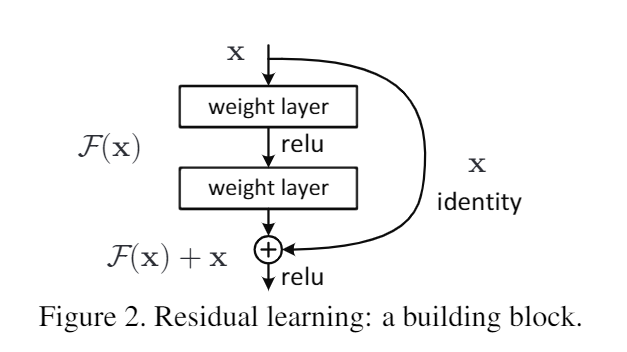
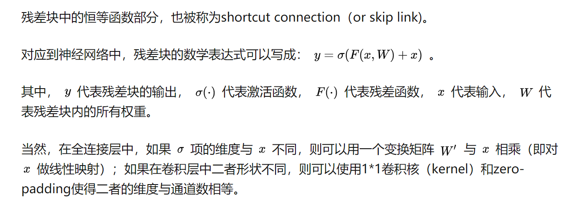
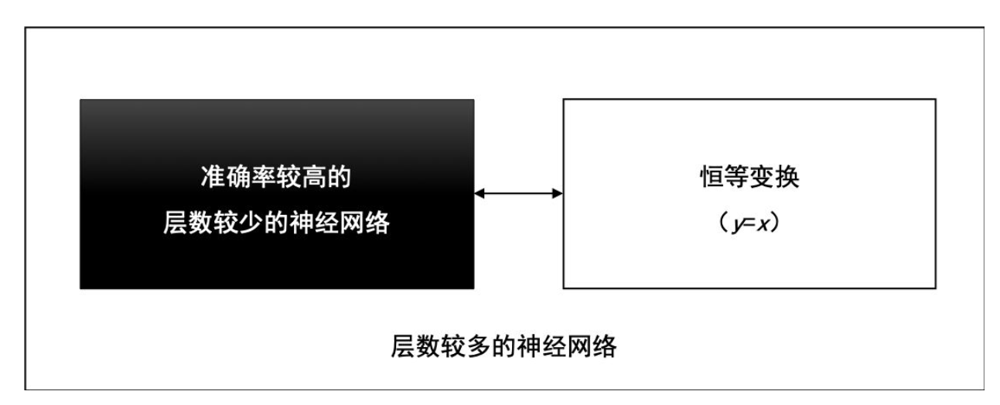
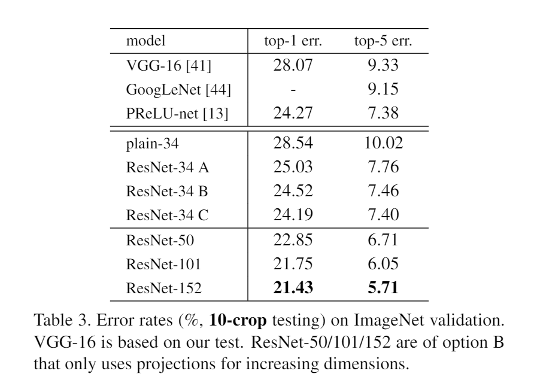

# ResNet


## 定义
residual networks

We present a residual learning framework to ease the training of networks that are substantially deeper than those used previously. 






## 来源

### 恒等变换
ResNet的提出，最初是为了解决“负优化”问题，也就是说让更深层的网络表现的至少和浅层网络一样好。

假设一个层数较少的神经网络已经达到了较高准确率，我们可以在这个神经网络之后，拼接一段恒等变换的网络层，这些恒等变换的网络层对输入数据不做任何转换，直接返回（y=x），就能得到一个深度较大的神经网络，并且，这个深度较大的神经网络的准确率等于拼接之前的神经网络准确率，准确率没有理由降低。



由于神经网络需要做一些非线性的变换，所引入的激活函数也越来越多，数据被映射到更加离散的空间，此时已经难以让数据回到原点（恒等变换）所以更深的层次不一定能获得更高的精度。

于是，ResNet团队在ResNet模块中增加了快捷连接分支，在线性转换和非线性转换之间寻求一个平衡。



## 代码

```
import torch
from torch import nn
from torch.nn import functional as F

class Residual(nn.Module):
    def __init__(self, input_channels, num_channels, use_conv=False, strides=1):
        super().__init__()
        self.conv1 = nn.Conv2d(input_channels, num_channels, kernel_size=3, padding=1, stride=strides)
        self.conv2 = nn.Conv2d(num_channels, num_channels, kernel_size=3, padding=1)
        if use_conv:
            self.conv3 = nn.Conv2d(input_channels, num_channels, kernel_size=3, padding=1)
        else:
            self.conv3 = None
        self.bn1 = nn.BatchNorm2d(num_channels)
        self.bn2 = nn.BatchNorm2d(num_channels)
    
    def forward(self, X):
        Y = F.relu(self.bn1(self.conv1(X)))
        Y = self.bn2(self.conv2(Y))
        if self.conv3:
            X = self.conv3(X)
        Y += X
        return F.relu(Y)
```

## 参考

- [Deep Residual Learning for Image Recognition](https://arxiv.org/abs/1512.03385)

- [深度学习之残差神经网络（ResNet）](https://zhuanlan.zhihu.com/p/463935188)